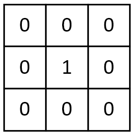
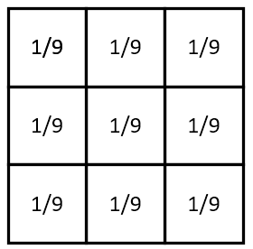
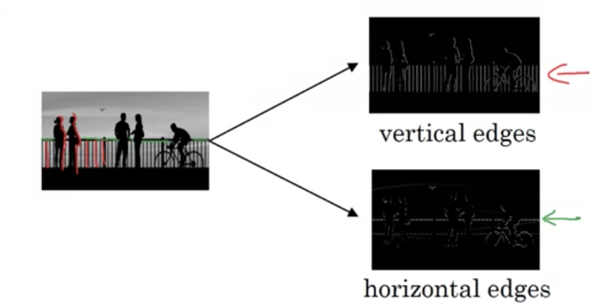
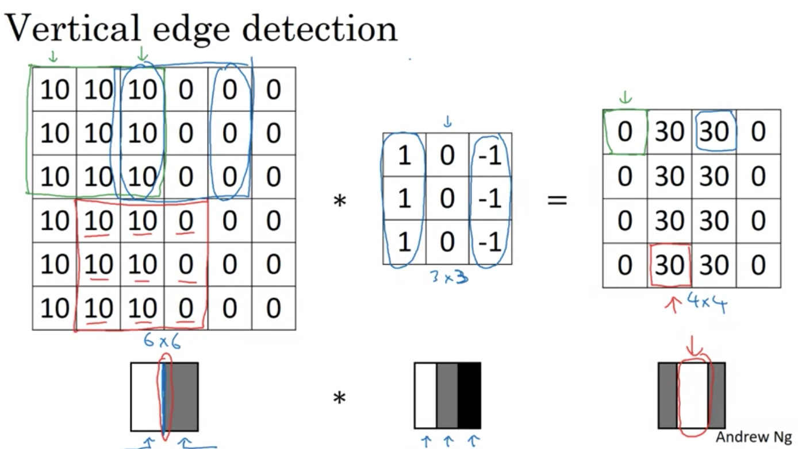
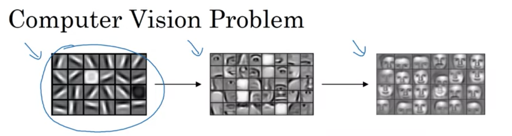
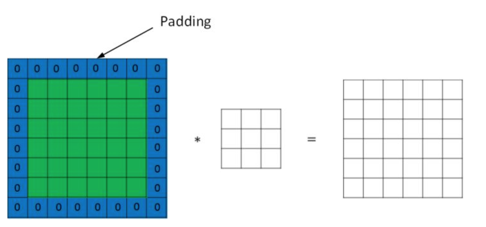

## Convolutional Neural Network Week 1

### 目录
- [Computer Vision](#computer-vision)
- [Edge Detection](#edge-detection)
- [Padding](#padding)
- [Strided Convolutions](#strided-convolutions)
- [Convolutions Over Volume](#convolutions-over-volume)
- [One Layer of a Convolutional Network](#one-layer-of-a-convolutional-network)
- [Simple Convolutional Network Example](#simple-convolutional-network-example)
- [Pooling Layers](#pooling-layers)
- [CNN Example](#cnn-example)
- [Why Convolutions?](#why-convolutions?)

### Computer Vision
计算机视觉问题有以下几类:
- 图片分类
- 目标检测
- 神经风格转换

**为什么不考虑用DNN?**  
因为DNN会造成参数量太大出现以下问题:
- 神经网络容易过拟合
- 内存和计算量都很大

当输入为 1000 * 1000 * 3 时, 假设第一层有1000个隐藏单元,
则在第一层的时候参数的维度为 (1000 , 3000000), 所以是一个一千乘以三百万的矩阵

### Edge Detection
**卷积的意义**  
数字图像是一个二维的离散信号，对数字图像做卷积操作其实就是利用卷积核（卷积模板）在图像上滑动，将图像点上的像素值与对应的卷积核上的数值相乘，然后将所有相乘后的值相加作为卷积核中间像素对应的图像上像素的值，并最终滑动完所有图像的过程.  
- 卷积核的大小一般是奇数,这样的话可以按照中间的像素点中心对称
- 当卷积核所有元素之和等于1时,可以与原始图像的能量(亮度)守恒
- 当卷积核所有元素之和大于1时,滤波后的图像会比原图像更亮,反之更暗
- 对于滤波后的结构可能会出现负数或者大于255的值. 对于这种情况直接截断到0~255,对于负数也可以取绝对值  

不同的卷积核对于图像的处理有不同的意义. 经常会有平滑, 模糊, 去噪, 锐化, 边缘提取等等工作.

*一个没有任何作用的卷积核*  
将原像素中间像素值乘1，其余全部乘0，显然像素值不会发生任何变化

*平滑均值滤波*
该卷积核的作用在于取九个值的平均值代替中间像素值，所以起到的平滑的效果

**边缘检测**  
下图是一个边缘检测的实例

下图是垂直方向的一个边缘检测特例(只有灰度值), 可以看到在最左图中间为一个垂直的边缘(左边为白色,右边为黑色), 经历的3*3的卷积核之后, 中间垂直的边缘所在的位置对比于起左右会更加明亮,从而达到检测到垂直方向边缘的效果

**卷积神经网络**  

对于卷积神经网络其实就是由浅层到深层到一个特征提取过程, 在浅层时可以检测出图片到边缘特征(垂直,水平边缘),局部特征(眼睛鼻子),到后面到网络则可以根据前面检测到到特征来识别整体到面部轮廓.也可以理解为,假设第一层检测到了边缘信息如(水平,垂直,斜方向), 然后在后面一层中总结了前面一层的边缘信息后得到更深层次的信息(如圆,正方形等), 最终通过层层递进得到可以识别到某个物体的网络.

由上面卷积的意义可知, 对于不同的卷积核可以产生出不同的特征, 所以在卷积神经网络中,就是对这些卷积核的参数来进行学习

### Padding
假设输入图片的大小为 n×n，而滤波器的大小为 $f×f$，则卷积后的输出图片大小为 $(n−f+1)×(n−f+1)$。

这样做会有两个缺陷:
- 如果每一次使用一个卷积操作,输出的图像都会缩小,做不了几次卷积特征图就会变得非常的小
- 图片角落或者边际线上的像素,只会在输出中被使用一次. 相对而言由于次数和其他部分的像素比少了很多,所以会丢失许多图片上靠近边界的信息   

为了解决这些问题，可以在进行卷积操作前，对原始图片在边界上进行填充（Padding），以增加矩阵的大小。通常将 0 作为填充值。

设每个方向扩展像素点数量为 p，则填充后原始图片的大小为 $(n+2p)×(n+2p)$，过滤器大小保持 $f×f$ 不变，则输出图片大小为 $(n+2p−f+1)×(n+2p−f+1)$。

因此，在进行卷积运算时，我们有两种选择：
- Valid 卷积：不填充，直接卷积。结果大小为 $(n−f+1)×(n−f+1)$；
- Same 卷积：进行填充，并使得卷积后结果大小与输入一致，这样 $p=\frac{f−1}{2}$.  

在计算机视觉领域，$f$ 通常为奇数。原因包括 Same 卷积中 $p=\frac{f−1}2$ 能得到自然数结果，并且过滤器有一个便于表示其所在位置的中心点。

### Strided Convolutions
卷积过程中，有时需要通过填充来避免信息损失，有时也需要通过设置步长（Stride）来压缩一部分信息。
