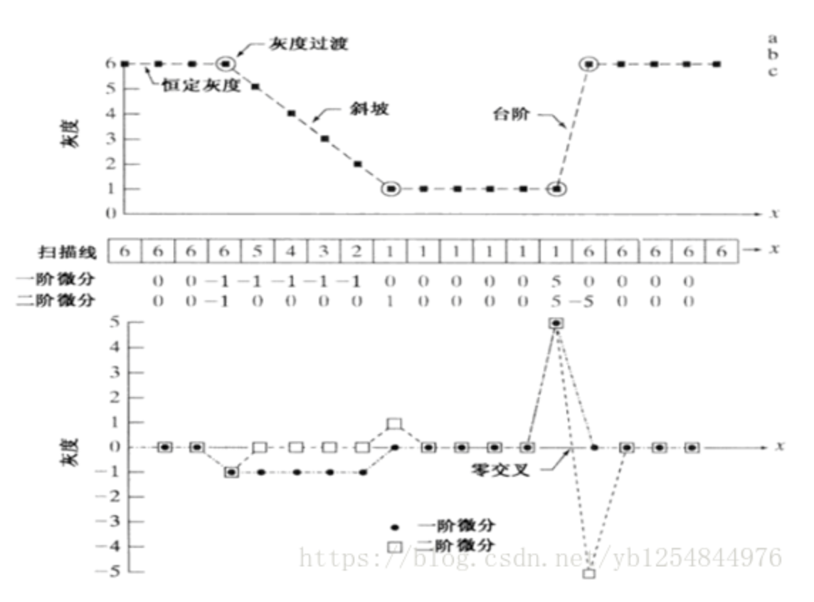

## 图像处理中导数的原理
为什么卷积核能检测到边缘呢? 首先考虑图片的边缘信息如何更强, 结论是当图像中当物体轮廓边缘当灰度值变化强烈,层次感很强所以图片更加清晰,图片中更多物体轮廓也清晰.  
所以在这里灰度变化明显与否,在图像处理中也是通过导数(梯度)来展示, 因为图像也可以看作是一个 $f(x,y)$ 的函数.

首先给出关于数字图像微分的定义:  
一阶导数
- 在恒定灰度区域的导数值为零
- 在灰度台阶或斜坡处导数值非零
- 沿着斜坡的导数值非零  

二阶微分
- 在恒定灰度区域的导数值为零
- 在灰度台阶或斜坡起点处导数值非零
- 沿着斜坡的导数值为零

因为图像是一个二维函数,所以其一阶导数为
$$\frac{\partial f(x,y)}{\partial x}=\lim_{\epsilon\rightarrow 0}{\frac{f(x+\epsilon,y )-f(x,y)}{\epsilon }}$$
$$\frac{\partial f(x,y)}{\partial y}=\lim_{\epsilon\rightarrow 0}{\frac{f(x,y+\epsilon)-f(x,y)}{\epsilon }}$$

因为对于图像而言 $\epsilon$ 不能无限小,最小的也只能是1像素,所以最终形式为
$$\frac{\partial f(x,y)}{\partial x}=f(x+1,y)-f(x,y)=gx$$
$$\frac{\partial f(x,y)}{\partial y}=f(x,y+1)-f(x,y)=gy$$

数字图像的二阶导数,以x方向为例
$$
\begin{split}
\frac{\partial^2f}{\partial x ^2} &= f'(x+1,y)-f'(x,y) \\
                                  &= f(x+2,y)−2f(x+1,y)+f(x,y) \\
\end{split}
$$

令 $x= x-1$   
$$\frac{\partial^2f}{\partial x ^2}=f(x+1,y)+f(x-1,y)-2f(x,y)$$
$$\frac{\partial^2f}{\partial y ^2}=f(x,y+1)+f(x,y-1)-2f(x,y)$$

从上式可以看出,梯度其实相当于两个相邻像素之间的差值.

解析来我们仅仅考虑一维数字函数的一阶导和二阶导的情况.

可以看到再边缘处(台阶处), 其二阶导数非常的大且与台阶相邻的两个像素点的差值也是最大的, 其他地方的值很小或者接近于0.  
或者二维的方式去展示

可以对于一阶导数，除了灰度突变的地方，其它灰度缓慢变化的地方数值相同，而且符号也相同。而二阶导数在灰度缓慢变化的地方数值为0，而在灰度突变的地方有符号相反的2个数值.也即二阶导数产生了一个像素宽的双边缘.

## 边缘检测卷积核
很多时候关注的是各向同性的滤波器，这种滤波器的响应与滤波器作用的图像的突变方向无关。也就是说，各向同性滤波器是旋转不变的，即将原图像旋转之后进行滤波处理，与先对图像滤波再旋转的结果应该是相同的。

我们以各向同性微分算子是拉普拉斯算子来表述.
$$
\begin{split}
\nabla^2f &= \frac{\partial^2f}{\partial x ^2} + \frac{\partial^2f}{\partial y ^2} \\
          &= f(x+1,y)+f(x-1,y) + f(x,y+1)+f(x,y-1) -4f(x,y)
\end{split}
$$
上式看起来比较麻烦, 所以我们考虑如果以 $x,y$ 为中心点, 则有:

这也就是我们的卷积核(滤波器), 对于一个像素点的 $x,y$ 二阶导数是可以由拉普拉斯来得到, 而采取卷积的(互相关)的形式对于整张图进行运算可以得到,整张图的二阶导数. 从而得到其边缘信息.

## 锐化
在这里多记录一点, 当我们已经得到了图像的边缘信息后,为了加强原图像的,我们则将原图像和算子求得的图像叠加起来.

以二维的灰度图像为例

在得到了二阶导数后, 在边缘处，有符号相反的二阶导数值，可以强化这个边缘的对比度, 所以进行了相减的操作.可以看到原图像与二阶导数图像合并后，在灰度均匀或灰度缓慢变化的地方，图像并没有任何改变；但在灰度突变的边缘处，原来是100和50的灰度差别，现在是150和10的灰度差别，对比度增强了很多.

*注意: 二阶导数比一阶导数获得的物体边界更加细致。但是，显而易见的，二阶导数对噪声点也更加敏感，会放大噪声的影响*

所以对于拉普拉斯算子的图像加强, 我们可以看作是原图像减去算子即:
$$
\begin{split}
f_{new}(x,y) &= f(x,y) - \nabla^2f \\
             &= 5f(x,y) - f(x+1,y) - f(x-1,y) -  f(x,y+1) - f(x,y-1)
\end{split}
$$

以卷积核表示即

